<!-- ========================================================= -->
<!--                     PROFILE HEADER                        -->
<!-- ========================================================= -->

<h1 align="center">Hi, I'm Eto'o Dimalla 👋</h1>

<h3 align="center">
B.Sc. Artificial Intelligence & Machine Learning Student
</h3>

  <b>AI/ML • Generative AI • Full-Stack Development • Automation</b>

  
  
  
  

---

<!-- ========================================================= -->
<!--                       ABOUT ME                            -->
<!-- ========================================================= -->

## About Me

I'm a **B.Sc. Artificial Intelligence & Machine Learning student at Sharda University**, interested in building practical software that combines **Artificial Intelligence, Machine Learning and full-stack development**.

I enjoy turning ideas into real applications — from AI-powered systems and automation tools to full-stack web applications.

Currently exploring:

- Artificial Intelligence & Machine Learning
- Generative AI & Large Language Models
- AI-powered applications
- Full-Stack Development
- Automation
- Computer Vision
- Data-driven applications
- Software architecture

I believe in learning by **building, experimenting and solving real-world problems**.

---

<!-- ========================================================= -->
<!--                    CURRENTLY BUILDING                     -->
<!-- ========================================================= -->

## What I'm Working On

### AI & Machine Learning

- Exploring Machine Learning and Deep Learning
- Building practical AI-powered applications
- Experimenting with Generative AI and LLM-based systems
- Learning AI application architecture and automation

### Full-Stack Development

- Building responsive web applications
- Developing backend APIs
- Working with databases and authentication
- Connecting AI models with real-world applications

### Current Projects

- **FIXO** — AI-powered services application
- **AURA** — Desktop AI assistant and automation system
- **Football Prediction System** — Machine-learning based sports analytics
- AI/ML academic and research projects

---

<!-- ========================================================= -->
<!--                       TECH STACK                          -->
<!-- ========================================================= -->

## Tech Stack

### Programming Languages

  

### AI / Machine Learning

  

  
  
  

### Full-Stack Development

  

### Databases

  

### Tools & Development Environment

  

---

<!-- ========================================================= -->
<!--                     FEATURED PROJECTS                     -->
<!-- ========================================================= -->
<!-- ========================================================= -->
<!--                 WEBSITES & CLIENT PROJECTS                -->
<!-- ========================================================= -->

## Websites & Client Projects

### Beauty by Asty

**Luxury Makeup Artist Website — Abidjan, Côte d'Ivoire**

A premium editorial-style website designed for Beauty by Asty, a professional makeup artist based in Abidjan.

The website focuses on presenting the brand, services and portfolio through a refined luxury aesthetic while making it easy for clients to get in touch and book appointments.

**Highlights:**

- Luxury editorial visual design
- Responsive mobile-first experience
- French / English language support
- Makeup services presentation
- Portfolio / gallery
- WhatsApp booking integration
- Instagram integration
- Premium brand-focused UI
- Custom visual identity

**Stack:**

`HTML` `CSS` `JavaScript` `Responsive Design` `UI/UX`

  

---

### L'Empreinte d'Emil

**Luxury E-Commerce Website — Douala, Cameroon**

A luxury online shopping experience created for L'Empreinte d'Emil, a fashion and beauty-focused brand based in Douala.

The website was designed around a premium black, gold and white visual identity while providing a mobile-friendly shopping experience and direct customer communication.

**Highlights:**

- Luxury e-commerce design
- Black / gold / white visual identity
- French / English experience
- Mobile-first interface
- Product showcase
- WhatsApp ordering
- Delivery information
- Social media integration
- Luxury packaging presentation
- Customer-focused shopping experience

**Stack:**

`HTML` `CSS` `JavaScript` `Responsive Design` `E-Commerce`

  

---

### Other Web Projects

I'm continuously building and experimenting with websites and digital products for businesses, personal projects and real-world use cases.

**Areas:**

`Business Websites` `Landing Pages` `E-Commerce` `UI/UX` `Web Applications` `AI-Powered Websites`

---

## AI & Software Projects

### FIXO

**AI-powered services application**

A services application designed to connect customers with service professionals while providing intelligent worker discovery, profiles, ratings, recommendations and transaction management.

**Focus:**

`Artificial Intelligence` `Full-Stack Development` `Recommendations` `Mobile` `Payments`

---

### AURA

**Desktop AI Assistant**

A desktop AI assistant concept focused on natural-language and voice-based interaction with a computer.

**Focus:**

`AI` `Voice Interaction` `Desktop Automation` `Electron` `Python`

---

### Football Prediction System

**Machine Learning Sports Analytics**

A machine-learning project focused on analysing football data, team performance and player statistics.

**Focus:**

`Python` `Machine Learning` `Data Analysis` `Statistics` `APIs`

---

### AI & Machine Learning Projects

Academic and experimental projects covering:

- Machine Learning
- Deep Learning
- Computer Vision
- Neural Networks
- Generative AI
- Data Analysis
- AI-powered applications

---

<!-- ========================================================= -->
<!--                        EDUCATION                          -->
<!-- ========================================================= -->

## Education

### B.Sc. Artificial Intelligence & Machine Learning

**Sharda University**

India

Currently pursuing undergraduate studies in Artificial Intelligence & Machine Learning.

Areas of study include:

`Artificial Intelligence` `Machine Learning` `Deep Learning` `Data Science` `Database Systems` `Software Development`

---

<!-- ========================================================= -->
<!--                      CERTIFICATIONS                       -->
<!-- ========================================================= -->

## Certifications & Learning

Currently expanding my knowledge through academic studies, professional courses and hands-on projects in:

- Artificial Intelligence
- Machine Learning
- Generative AI
- Python
- Full-Stack Development
- Database Management
- Cloud Technologies
- Prompt Engineering
- Software Development

More certifications and projects will be added as I complete them.

---
<!-- ========================================================= -->
<!--                  GITHUB STATISTICS                        -->
<!-- ========================================================= -->

## GitHub Statistics

  

  

---

<!-- ========================================================= -->
<!--                     CONTRIBUTIONS                         -->
<!-- ========================================================= -->

## Contribution Activity

  

---

<!-- ========================================================= -->
<!--                         GOALS                             -->
<!-- ========================================================= -->

## 2026 Goals

- Build and deploy more real-world AI applications
- Strengthen my Machine Learning and Deep Learning foundations
- Become stronger in backend and system design
- Build production-ready full-stack applications
- Explore AI agents and autonomous systems
- Contribute to open-source projects
- Build a strong portfolio of practical AI projects
- Continue developing as an AI/ML engineer

---

<!-- ========================================================= -->
<!--                       PHILOSOPHY                          -->
<!-- ========================================================= -->

## Developer Philosophy

> **Learn → Build → Break → Understand → Improve → Repeat**

I don't want to only learn technologies.

I want to understand how they work, use them to solve real problems, and continuously improve through building.

---

<!-- ========================================================= -->
<!--                         CONTACT                           -->
<!-- ========================================================= -->

## Let's Connect

I'm always interested in connecting with developers, AI/ML enthusiasts, students, researchers and people building interesting technology.

---

  <i>Building ideas into intelligent software.</i>

  © 2026 Eto'o Dimalla

